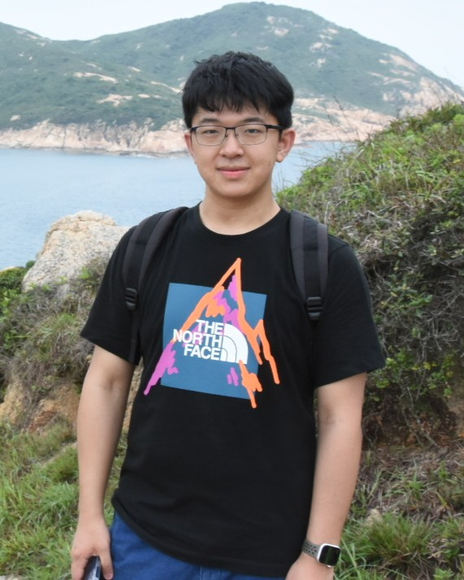

:::: {.home-hero}
:::: {.home-hero__media}
{.home-hero__portrait}
::::
:::: {.home-hero__body}
# Yameng Zhang

<p class="home-hero__role">Postdoctoral Researcher in Medical Robotics and Imaging</p>

<div class="home-hero__meta">
  <p class="home-hero__item"><span class="home-hero__item-icon" aria-hidden="true"><svg viewBox="0 0 24 24" fill="none" stroke="currentColor" stroke-width="1.8" stroke-linecap="round" stroke-linejoin="round"><path d="M12 21s6-4.35 6-10a6 6 0 1 0-12 0c0 5.65 6 10 6 10Z"></path><circle cx="12" cy="11" r="2.5"></circle></svg></span><span class="home-hero__item-text"><a href="https://www.mrc-cuhk.com/">Multi-scale Medical Robotics Center</a>, <a href="https://www.innohk.gov.hk/en/r-d-centres/air-innohk/multi-scale-medical-robotics-center/">AIR@InnoHK</a>.</span></p>
  <p class="home-hero__item"><span class="home-hero__item-icon" aria-hidden="true"><svg viewBox="0 0 24 24" fill="none" stroke="currentColor" stroke-width="1.8" stroke-linecap="round" stroke-linejoin="round"><path d="M12 21s6-4.35 6-10a6 6 0 1 0-12 0c0 5.65 6 10 6 10Z"></path><circle cx="12" cy="11" r="2.5"></circle></svg></span><span class="home-hero__item-text"><a href="https://meweb.hku.hk/zljiang/people/">Medical Intelligence and Robotic Cognition (MIRoC) Lab</a>, <a href="https://mech.hku.hk/">Department of Mechanical Engineering</a>, <a href="https://www.hku.hk/">The University of Hong Kong</a>.</span></p>
</div>

<p class="home-hero__contact"><span class="home-hero__contact-icon" aria-hidden="true"><svg viewBox="0 0 24 24" fill="none" stroke="currentColor" stroke-width="1.8" stroke-linecap="round" stroke-linejoin="round"><rect x="3" y="5" width="18" height="14" rx="2"></rect><path d="m4 7 8 6 8-6"></path></svg></span><span class="home-hero__contact-text"><a href="mailto:yamengzhang@mrc-cuhk.com">yamengzhang@mrc-cuhk.com</a> | <a href="mailto:yamengzh@hku.hk">yamengzh@hku.hk</a></span></p>

:::: {.home-link-row}
[Google Scholar](https://scholar.google.com/citations?user=SFxTNpQAAAAJ&hl)
[GitHub](https://github.com/YamengZZZ)
[LinkedIn](https://www.linkedin.com/in/yameng-zhang-0ab4711bb/)
[YouTube](https://www.youtube.com/@yamengzhang8563)
::::

::::

::::

:::: {.home-main-grid}
:::: {.home-main-column}
## About Me

Hi there! My name is **Yameng Zhang (张亚蒙)**. I am a Postdoctoral Researcher at the [Multi-scale Medical Robotics Center (MRC)](https://www.mrc-cuhk.com/), [AIR@InnoHK](https://www.innohk.gov.hk/en/r-d-centres/air-innohk/multi-scale-medical-robotics-center/), and a member of the [Medical Intelligence and Robotic Cognition (MIRoC) Lab](https://meweb.hku.hk/zljiang/people/) in the [Department of Mechanical Engineering](https://mech.hku.hk/) at [The University of Hong Kong (HKU)](https://www.hku.hk/). I received my Ph.D. in [Electronic Engineering](https://www.ee.cuhk.edu.hk/en-gb/) from [The Chinese University of Hong Kong (CUHK)](https://www.cuhk.edu.hk/chinese/index.html) in 2025, under the supervision of [Prof. Max Q.-H. Meng](https://www.ee.cuhk.edu.hk/en-gb/people/academic-staff/chairman/30-prof-qing-hu-max-meng) and [Prof. Hongliang Ren](https://www.ee.cuhk.edu.hk/en-gb/people/academic-staff/professors/prof-ren-hongliang). From October 2024 to March 2025, I was a visiting Ph.D. student at the [Computer Aided Medical Procedures (CAMP) Chair](https://www.cs.cit.tum.de/en/camp/start/), [Technische Universität München (TUM)](https://www.tum.de/en/), advised by [Prof. Nassir Navab](https://www.cs.cit.tum.de/camp/members/cv-nassir-navab/nassir-navab/) and [Prof. Zhongliang Jiang](https://meweb.hku.hk/zljiang/). Prior to that, I earned my M.Eng. in [Mechanical Engineering](https://me.sjtu.edu.cn/) from [Shanghai Jiao Tong University (SJTU)](https://me.sjtu.edu.cn/) in 2021 and my B.Eng. in [Vehicle Engineering](https://me.bit.edu.cn/) from the [Beijing Institute of Technology (BIT)](https://www.bit.edu.cn/) in 2017.

My research interests lie in **Medical Robotics and Imaging**, with a particular focus on **Intelligent Robotic Ultrasound Imaging Systems**. My work spans ultrasound image analysis, multi-modal information sensing with AI-assisted fusion, and 3-D reconstruction and visualization. I am also interested in **Robot Learning and Control** for efficient robotic perception and manipulation. In addition, I have extensive experience in **Medical Robotic System Design and Control**, encompassing robotic hardware and software development as well as vision- and magnetic-based control algorithms. Together, these multidisciplinary strengths drive my overarching research goal: to advance truly intelligent, clinically reliable, and patient-accepted medical robotic systems.

::::

:::: {.home-side-column}
::: {.home-side-column__inner}
## News

::: {.home-news__scroll}
- [2026-07-07] Joined the [Medical Intelligence and Robotic Cognition (MIRoC) Lab](https://meweb.hku.hk/zljiang/people/), Department of Mechanical Engineering, The University of Hong Kong (HKU) as a Postdoctoral Researcher.
- [2025-12-15] Received my Ph.D. in Computer Science from the Technische Universität München (TUM), advised by Prof. Nassir Navab, graduating with *summa cum laude* (highest distinction).
- [2020-06-01] Received my M.Eng. in Computer Science from South China University of Technology (SCUT).
- [2017-06-01] Received my B.Eng. in Computer Science from South China University of Technology (SCUT).

- [2026-07-07] Joined the [Medical Intelligence and Robotic Cognition (MIRoC) Lab](https://meweb.hku.hk/zljiang/people/), Department of Mechanical Engineering, The University of Hong Kong (HKU) as a Postdoctoral Researcher.
- [2025-12-15] Received my Ph.D. in Computer Science from the Technische Universität München (TUM), advised by Prof. Nassir Navab, graduating with *summa cum laude* (highest distinction).
- [2020-06-01] Received my M.Eng. in Computer Science from South China University of Technology (SCUT).
- [2017-06-01] Received my B.Eng. in Computer Science from South China University of Technology (SCUT).

- [2026-07-07] Joined the [Medical Intelligence and Robotic Cognition (MIRoC) Lab](https://meweb.hku.hk/zljiang/people/), Department of Mechanical Engineering, The University of Hong Kong (HKU) as a Postdoctoral Researcher.
- [2025-12-15] Received my Ph.D. in Computer Science from the Technische Universität München (TUM), advised by Prof. Nassir Navab, graduating with *summa cum laude* (highest distinction).
- [2020-06-01] Received my M.Eng. in Computer Science from South China University of Technology (SCUT).
- [2017-06-01] Received my B.Eng. in Computer Science from South China University of Technology (SCUT).
:::
:::
::::
::::

## Selected Publications [[Google Scholar]{.pub-scholar-link}](https://scholar.google.com/citations?user=SFxTNpQAAAAJ&hl)

```{=html}
<div class="pub-list">

  <div class="pub-item">
    <div class="pub-thumb">
      
    </div>
    <div class="pub-body">
      <div class="pub-title">Improving Robustness to Out-of-Distribution States in Imitation Learning via Deep Koopman-Boosted Diffusion Policy</div>
      <div class="pub-authors"><span class="pub-me">Dianye Huang</span>, Nassir Navab, and Zhongliang Jiang</div>
      <div class="pub-venue"><em>IEEE Transactions on Robotics</em>. <em>Code</em> can be <a href="#">found here</a>, 2025</div>
      <div class="pub-links">
        <a class="pub-btn" href="#">HTML</a>
        <a class="pub-btn" href="#">VIDEO</a>
        <a class="pub-btn" href="#">BIB</a>
      </div>
    </div>
  </div>

  <div class="pub-item">
    <div class="pub-thumb">
      
    </div>
    <div class="pub-body">
      <div class="pub-title">Improving Probe Localization for Freehand 3D Ultrasound Using Lightweight Cameras</div>
      <div class="pub-authors"><span class="pub-me">Dianye Huang</span>, Nassir Navab, and Zhongliang Jiang</div>
      <div class="pub-venue"><em>In 2025 IEEE International Conference on Robotics and Automation (ICRA)</em>. <em>Code</em> can be <a href="#">found here</a>, 2025</div>
      <div class="pub-links">
        <a class="pub-btn" href="#">HTML</a>
        <a class="pub-btn" href="#">VIDEO</a>
        <a class="pub-btn" href="#">BIB</a>
      </div>
    </div>
  </div>

  <div class="pub-item">
    <div class="pub-thumb">
      
    </div>
    <div class="pub-body">
      <div class="pub-title">Vibnet: Vibration-boosted needle detection in ultrasound images</div>
      <div class="pub-authors"><span class="pub-me">Dianye Huang</span>, Chenyang Li, Angelos Karlas, Xiangyu Chu, KW Samuel Au, Nassir Navab, and Zhongliang Jiang</div>
      <div class="pub-venue"><em>IEEE Transactions on Medical Imaging</em>. <em>Code</em> can be <a href="#">found here</a>, 2025</div>
      <div class="pub-links">
        <a class="pub-btn" href="#">HTML</a>
        <a class="pub-btn" href="#">VIDEO</a>
        <a class="pub-btn" href="#">BIB</a>
      </div>
    </div>
  </div>

</div>
```

<!-- [View the full publication list](publications.qmd) -->

## Selected Honors and Awards

```{=html}
<div class="plain-list">
2025, IEEE T-MI Distinguished Reviewer<br>
2025, First Place Award in ACM MM 2025 RoboSoft Workshop<br>
2025, Best Poster Award in IROS 2025 Workshop on Soft Tissue Manipulation<br>
2025, Yamaguchi Medal from Asian-Pacific Association for Biomechanics<br>
2025, MICCAI Young Scientist Award (5/3677)<br>
2025, Ant Group Intech-Future Scholarship (10 Awardees Worldwide)<br>
2025, IROS IES SYP Travel Award<br>
2025, MRC Symposium Best Application Award<br>
2024, MICCAI Best Paper Runner Up (3/2771)<br>
2024, Runner Up of MICCAI BraTS Challenge on Sub-Sahara-Africa Adult Glioma<br>
2024, PhD International Mobility for Partnerships and Collaborations (IMPAC) Award<br>
2024, IPCAI Best Paper Award Shortlist<br>
2024, CUHK Overseas Research Attachment Scholarship (12 Awardees in CUHK)<br>
2024, Best Poster Award in ICRA 2024 C4SR+ Workshop<br>
2024, ICRA RAS Travel Grants Award<br>
2023, ICBIR Best Student Paper Award<br>
2023, Best Poster Award in ICRA 2023 Workshop on Surgical Robotics<br>
2023, ICRA RAS Travel Grants Award<br>
2021, CUHK Vice-Chancellor's Ph.D. Scholarship Scheme
</div>
```

## Academic Services

```{=html}
<div class="plain-list">
<strong>Journal Reviewer:</strong><br>
The International Journal of Robotics Research (IJRR), Transactions on Robotics (T-RO), Transactions on Mechatronics (T-Mech), Transactions on Pattern Analysis and Machine Intelligence (TPAMI), Robotics and Automation Letters (RA-L), Robotics &amp; Automation Magazine (RAM), Transactions on Cognitive and Developmental Systems (TCDS), Frontiers in Neurorobotics, Transactions on Industrial Electronics, Journal of Zhejiang University (JZUSA).<br>
<br>
<strong>Conference Reviewer:</strong><br>
Robotics: Science and Systems (RSS), International Conference on Robotics and Automation (ICRA), International Conference on Intelligent Robots and Systems (IROS), International Conference on Humanoid Robots (Humanoids), International Conference on Automation Science and Engineering (CASE), The Conference on Robot Learning (CoRL), Conference on Decision and Control (CDC), Control Conference Africa (CCA).
</div>
```

## Teaching

```{=html}
<div class="plain-list">
2024-2025 Spring, ELEG5757 Intelligent Wearable Electronics<br>
2024-2025 Spring, ELEG3103 Robotic Perception and Intelligence<br>
2023-2024 Spring, ELEG5600 Advanced Perception for Intelligent Robotics<br>
2023-2024 Fall, ENGG2760 Probability for Engineers<br>
2022-2023 Spring, ELEG5757 Intelligent Wearable Electronics<br>
2022-2023 Fall, ENGG2760 Probability for Engineers<br>
2021-2022 Spring, ELEG3201 Microelectronic Devices and Circuits<br>
2021-2022 Fall, ENGG2760 Probability for Engineers
</div>
```


```{=html}
<script>
(function () {
  function syncNewsHeight() {
    var about = document.querySelector('.home-main-column');
    var inner = document.querySelector('.home-side-column__inner');
    if (!about || !inner) return;
    inner.style.height = '';
    if (window.matchMedia('(max-width: 960px)').matches) return;
    inner.style.height = about.getBoundingClientRect().height + 'px';
  }
  window.addEventListener('load', syncNewsHeight);
  window.addEventListener('resize', syncNewsHeight);
})();
</script>
```
